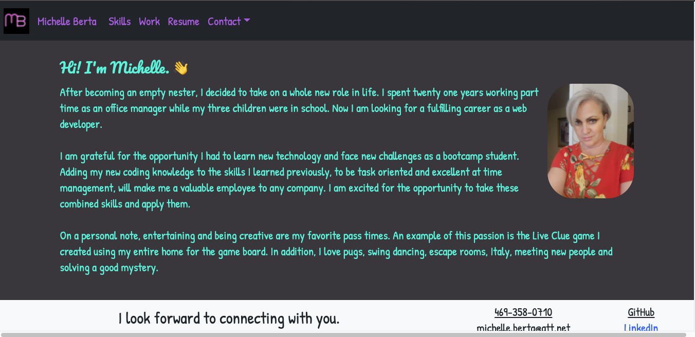
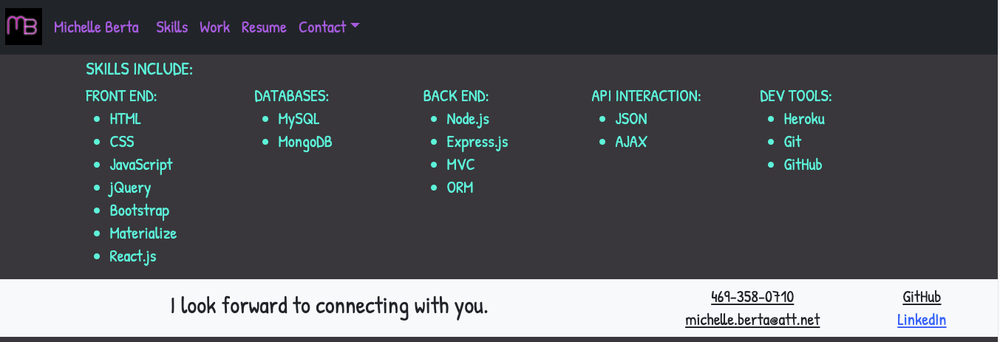

# Michelle Berta's Portfolio in React.js

## Table of Contents
* [Description](#description)
* [Technology](#technology)
* [Screenshots](#screenshots)
* [Demonstration](#demonstration)

## Description
This is my portfolio created using bootstrap in React.  The user has the ability to click the navigation to go to examples of my work and skills learned.  My contact information and resume can be accesses using the navigation links as well.  The work example cards include gifs and links to their repos or demo videos. 

### Click this link to view the deployed application (https://) 

## Technology
* React.js
* React Bootstrap
* HashRouter
* Bootstrap
* CSS

## Screenshots

